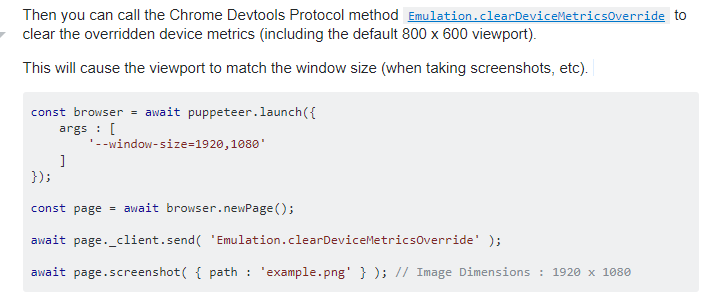

= ASCIIDoctor to Browser Viewing
John Schuster <John.schuster@PhoenixWorkgroup.com>
v2.1b, 03/19/2019: Doco Type
:Author: John HR Schuster
:Company: GeekMustHave
:toc: left
:toclevels: 4:
:imagesdir: ./images
:pagenums:
:numbered: 
:chapter-label: 
:experimental:
:source-hightlighter: coderay
:icons: font
:docdir: ./documents
:github: https://github.com/GeekMustHave/Github repository
:linkattrs:
:seclinks:
:title-logo-image: ./images/create-doco_gmh-standard-cover.png

This is a simple NODE project to be called from the command line to read an ADOC file and launch a browser with the HTML version of the ADOC file.

The project will use `asciidoctor.js` and `Puppeteer`.  The goal is an EXE file that can do the generation.

A PDF version of this document is available at this link:./readme.pdf[ link] poop poop

== Overview

The ASCIIDoctor tool chain requires Ruby and GEM's to be installed.  
After any change to the ADOC file the ASCIIDoctor command is needed to generate the HTML.
A browser must then either be opened and or pointed to the generated HTML file.

The ASCIIDoctor.JS can be installed as an extension to the Chrome browser and the ADOC file can be opened directly using the kbd:[ctrl+O] keys.

One of the advantages of this approach is that as the ADOC file is saved the HTML in the Chrome browser is automatically updated.
There is no need to run the ASCIIDoctor GEM to generate the HTML file.

Not all users have or use the Chrome browser, so this solution may not work in all cases.

NOTE: ASCIIDoctor.JS does a good enough job for rapid viewing of ADOC files, for more precision the ASCIIDoctor GEM should be used.

== Introduction

This ADOC2VIEW would be a command line utility that could be run from PowerShell, File Explorer or called from other programs.

The optional parameter would be the name of the ADOC file to process.
The lack of a parameter would show a list of all the ADOC files in the current directory.

The result would be a Chromium browser would be opened and the ADOC file would be processed into an HTML file and displayed.

One of the purposes for this utility is to learn how to use Chromium for NODE based applications.

== Project Build

This ADOC2View will be as simple a NODE CLI application as possible.

=== ASCIIDoctor.JS

This project uses Opal to transpile Asciidoctor, a modern implementation of AsciiDoc, 
from Ruby to JavaScript to produce asciidoctor.js. 
The asciidoctor.js script can be run on any JavaScript platform, including Node.js, Nashorn and, of course, a web browser.

Reference: https://asciidoctor.org/docs/asciidoctor.js/

User Manual: https://asciidoctor-docs.netlify.com/asciidoctor.js/

GitHub Repository: https://github.com/asciidoctor/asciidoctor.js/

Install in the project with

  npm install --save asciidoctor.js

=== Puppeteer

Puppeteer is a Node library which provides a high-level API to control Chrome or Chromium over the DevTools Protocol.
Puppeteer runs headless by default, but can be configured to run full (non-headless) Chrome or Chromium.

Puppeteer provides very precise control over the Chromium browser.

Reference: https://www.npmjs.com/package/puppeteer

API Reference: https://github.com/GoogleChrome/puppeteer/blob/v1.13.0/docs/api.md

Chromium Command line Switches: https://peter.sh/experiments/chromium-command-line-switches/

Note: When you install Puppeteer, it downloads a recent version of Chromium (~170MB Mac, ~282MB Linux, ~280MB Win) that is guaranteed to work with the API. 

Install in the project with

   npm install --save puppeteer

Puppeteer launches Chromium in headless mode. To launch a full version of Chromium, set the 'headless' option when launching a browser:

  const browser = await puppeteer.launch({headless: false}); // default is true

== Considerations

* The table of contents displays in the correct location depending on `:toc:` directive.

== Issues

* Browser windows opens with warning about 'Chrome is under control of automated test software'
** You're looking for the `--disable-infobars` flag, Pass this to puppeteer.launch([options])

* Links don't work

* images don't work

* if ADOC changes the browser windows doesn't automatically refresh.
** fs.FSWatcher

<<<<
== Document History

.Document History
[cols='2,2,2,6' options='header']
|===
| Date  | Version | Author | Description
| 03/19/2019 | V2.1b | JHRS |  Initial version
|===

////
This template created by GeekMustHave
////

